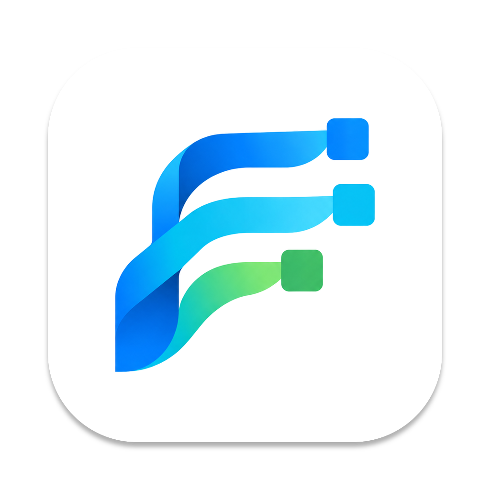

<p align="center">
  
</p>

# Ramus Next

**Java-based IDEF0 & DFD Modeler**

Maintained by [Stanislav Vinokur](https://github.com/stasvinokur).

Ramus Next continues [Ramus](https://ramussoftware.com/), created by Vitaliy Yakovchuk and Oleksiy Chizhevskiy (2005-2025), with macOS packaging and integration work by [Vladislav Pavlik](https://github.com/Inv1x). Released under the [GNU General Public License, version 3](https://www.gnu.org/licenses/gpl-3.0.en.html).


---

## Install

Each installer carries its own Java runtime, so nothing has to be installed first.

| Platform | Download |
|---|---|
| macOS, Apple Silicon | [Download latest release](https://github.com/stasvinokur/ramus-next/releases/latest/download/RamusNext-arm64.dmg) |
| macOS, Intel | [Download latest release](https://github.com/stasvinokur/ramus-next/releases/latest/download/RamusNext-x86_64.dmg) |
| Windows 64-bit | [Download latest release](https://github.com/stasvinokur/ramus-next/releases/latest/download/RamusNext-x64.msi) |

There are two macOS builds because the bundled runtime is native code and `jpackage` cannot produce a
universal bundle. Rosetta translates x86_64 to arm64 and not the other way round, so the Apple Silicon
DMG does not start on an Intel Mac at all.

## Local build

Any JDK **21 or newer** is enough to run the build. Which JDK you happen to have does not affect the
result: a Gradle toolchain pins compilation to Java 21, `options.release = 17` pins the bytecode, and
the toolchain JDK is downloaded if it is missing.

`jpackage` only ever builds for the operating system it is running on, so each installer has to be
built on its own platform.

**macOS**

```bash
./gradlew :local-client:macDmg
open dest/macos
```

Needs the preinstalled `sips` and `iconutil`, nothing else. To run from source without packaging:

```bash
./gradlew :local-client:runLocal
```

**Windows**

```bash
./gradlew :local-client:windowsMsi
```

Needs **WiX Toolset 3.x** on the `PATH` — version 3 specifically, because `jpackage` before JDK 24
invokes `candle.exe` and `light.exe` by name and WiX 4 and 5 do not provide them. The output is a
per-machine install into `Program Files`, with a Start menu entry and the `.rsf` association
registered.

## License

Ramus Next is free software, released under the [GNU General Public License, version 3](https://www.gnu.org/licenses/gpl-3.0.en.html). The full text is in [LICENSE](LICENSE).

- Copyright (C) 2005-2025 Vitaliy Yakovchuk, Oleksiy Chizhevskiy - original Ramus.
- macOS version modifications by [Vladislav Pavlik](https://github.com/Inv1x).
- Copyright (C) 2026 Stanislav Vinokur - Ramus Next.

Ramus Next adds to the original copyright notices; it does not replace them.
